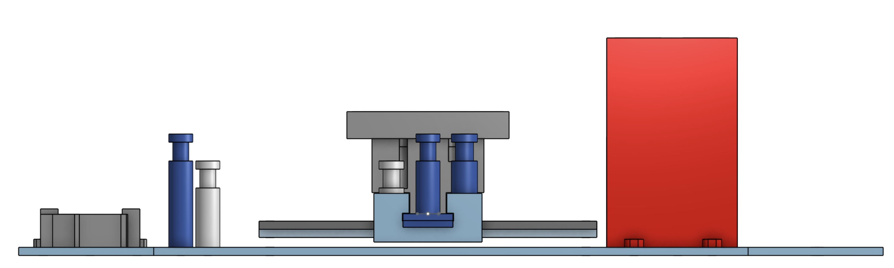
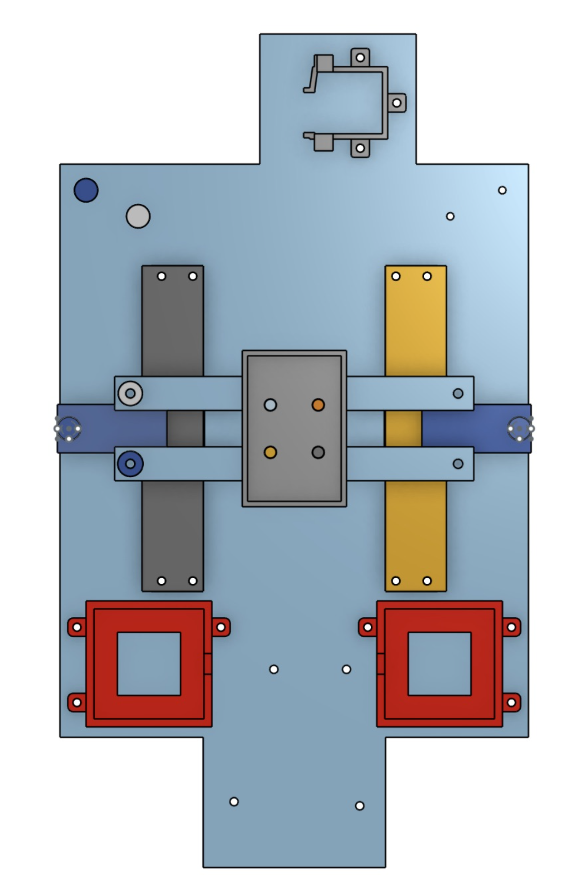
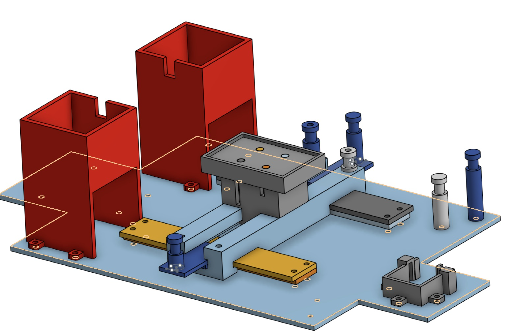

# WriterbotLG3

## TABLE_OF_CONTENTS
* [Table of Contents](#TABLE_OF_CONTENTS)
* [Project Description](#PROJECT_DESCRIPTION)
* [Onshape Link](#ONSHAPE_LINK)
* [The BOM](#THE_BOM)
* [Evidence](#EVIDENCE)
* [Onshape Models](#ONSHAPE_MODELS)
* [Code](#CODE)
* [Reflections](#REFLECTIONS)

## PROJECT_DESCRIPTION
We were assigned to make a robot arm for this project, but our group decided to take it in a slightly different direction. This project is a robot that writes out letters in a created language called Angarkase according to keyboard inputs put in by a person. To work the robot, keyboard inputs are entered in, and a small plate with a piece of paper moves with a pen over it, which is attached to a servo in order to lift and put down the pen. The project is appropriately challenging for being something that isn't a robot arm, and also solves the problem of not having a standardized way to write in Angarkase.

## ONSHAPE_LINK

(https://cvilleschools.onshape.com/documents/d0332011792ff0881e4ecb2d/w/f60ced9a74de595b67e1cf04/e/22963176449209f64e9ac10e?renderMode=0&uiState=664fa3f58b969a737dabac27)

## WIRING_DIAGRAM


## THE_BOM

* 1 Metro M4 Express
* 1 Battery Pack
* 4 AA Batteries
* 1 Acrylic baseplate
* 2 3D-printed motor towers
* 2 NEMA 17 Stepper motors
* 1 Breadboard
* 2 DRV8833 H-bridges
* 2 Small Acrylic Slider mounts
* 2 Large Acrylic Slider mounts
* 1 3D-printed y-direction slider
* 1 3D-printed x-direction slider
* 1 Positional Servo motor
* 1 3D-printed Servo mount
* 2 Long strips of GT2 Timing belt
* 2 3D-printed belt pulleys
* 2 3D-printed Belt tensioners
* 8 Belt towers of differing heights
* A bunch of 4-40 Nuts and Bolts
* Way too many Male-male jumper wires

## EVIDENCE


## ONSHAPE_MODELS



side view



top view



isometric view

## CODE
```python
import board
import time
import digitalio
from adafruit_motor import stepper 
from adafruit_motor import servo 
import pwmio 
#these are the necessary libraries

DELAY = 0.01
FULLTURN = 200 #Stepper has up to 200 steps, few variable
HALFTURN = 100
QTURN = 50 #quarter turn
ETURN = 25 #eighth turn
letnum = 0  #number of letter, allows for going to the next line + move down
linenum = 0 #number of line, allows count line

 
coils1 = (
    digitalio.DigitalInOut(board.D9),  # A1
    digitalio.DigitalInOut(board.D10), # A2
    digitalio.DigitalInOut(board.D11), # B1
    digitalio.DigitalInOut(board.D12), # B2
) # we gotta set up those coils

for coils in coils1:
    coils.direction = digitalio.Direction.OUTPUT #motor is the output


motor1 = stepper.StepperMotor(coils1[0], coils1[1], coils1[2], coils1[3], microsteps=None) #motor setup stuff

coils2 = (
    digitalio.DigitalInOut(board.D4),  # A1
    digitalio.DigitalInOut(board.D5), # A2
    digitalio.DigitalInOut(board.D6), # B1
    digitalio.DigitalInOut(board.D7), # B2
) # we gotta set up those coils for the second motor
#for the second motor instead of coils1 and motor1, use coils2 and motor2

for coils in coils2:
    coils.direction = digitalio.Direction.OUTPUT

motor2 = stepper.StepperMotor(coils2[0], coils2[1], coils2[2], coils2[3], microsteps=None)

pwm = pwmio.PWMOut(board.D2, duty_cycle=2 ** 15, frequency=50) #servo setup stuff

my_servo = servo.Servo(pwm) #naming the servo

#FUNCTION GUIDE:
#For the servo functions, there is an s in front of the direction that it goes in
#The motor functions do not have an initial letter, just the direction the plate will go in
#If there are two directions, i.e. upright, or downleft, it is a diagonal movement in that direction
#The number after the motor function indicates how much of a turn the motors will do, but it is one/number turn
#For example
# take the below function, no initial s, so it's for the motor, and it will move the plate right
def right1(): # the 1 indicates a fullturn
    for step in range (FULLTURN):
        motor2.onestep(style=stepper.DOUBLE) #both motors are moving forward, creating right motion in corexy system
        motor1.onestep(style=stepper.DOUBLE)
        time.sleep(DELAY)

def right2 (): #the 2 here means a half turn
    for step in range (HALFTURN):
        motor2.onestep(style=stepper.DOUBLE)
        motor1.onestep(style=stepper.DOUBLE)
        time.sleep(DELAY)

def right4 (): #4 is for quarter turn
    for step in range (QTURN):
        motor2.onestep(style=stepper.DOUBLE)
        motor1.onestep(style=stepper.DOUBLE)
        time.sleep(DELAY)

def right8 (): #and so on and so forth
    for step in range (ETURN):
        motor2.onestep(style=stepper.DOUBLE)
        motor1.onestep(style=stepper.DOUBLE)
        time.sleep(DELAY)


def left1 ():
    for step in range (FULLTURN):
        motor2.onestep(direction=stepper.BACKWARD)
        motor1.onestep(direction=stepper.BACKWARD)
        time.sleep(DELAY)

def left2 ():
    for step in range (HALFTURN):
        motor2.onestep(direction=stepper.BACKWARD)
        motor1.onestep(direction=stepper.BACKWARD)
        time.sleep(DELAY)

def left4 ():
    for step in range (QTURN):
        motor2.onestep(direction=stepper.BACKWARD)
        motor1.onestep(direction=stepper.BACKWARD)
        time.sleep(DELAY)

def left8 ():
    for step in range (ETURN):
        motor2.onestep(direction=stepper.BACKWARD)
        motor1.onestep(direction=stepper.BACKWARD)
        time.sleep(DELAY)

def up1 ():
    for step in range (FULLTURN):
        motor2.onestep(style=stepper.DOUBLE)
        motor1.onestep(direction=stepper.BACKWARD)
        time.sleep(DELAY)

def up2 ():
    for step in range (HALFTURN):
        motor2.onestep(style=stepper.DOUBLE)
        motor1.onestep(direction=stepper.BACKWARD)
        time.sleep(DELAY)

def up4 ():
    for step in range (QTURN):
        motor2.onestep(style=stepper.DOUBLE)
        motor1.onestep(direction=stepper.BACKWARD)
        time.sleep(DELAY)

def up8 ():
    for step in range (ETURN):
        motor2.onestep(style=stepper.DOUBLE)
        motor1.onestep(direction=stepper.BACKWARD)
        time.sleep(DELAY)

def down1 ():
    for step in range (FULLTURN):
        motor2.onestep(direction=stepper.BACKWARD)
        motor1.onestep(style=stepper.DOUBLE)
        time.sleep(DELAY)

def down2 ():
    for step in range (HALFTURN):
        motor2.onestep(direction=stepper.BACKWARD)
        motor1.onestep(style=stepper.DOUBLE)
        time.sleep(DELAY)

def down4 ():
    for step in range (QTURN):
        motor2.onestep(direction=stepper.BACKWARD)
        motor1.onestep(style=stepper.DOUBLE)
        time.sleep(DELAY)

def down8 ():
    for step in range (ETURN):
        motor2.onestep(direction=stepper.BACKWARD)
        motor1.onestep(style=stepper.DOUBLE)
        time.sleep(DELAY)

def upright1 (): #getting fancy with diagonals
    for step in range(FULLTURN):
        motor1.onestep(direction=stepper.BACKWARD)
        time.sleep(DELAY)

def upright2 ():
    for step in range(HALFTURN):
        motor1.onestep(direction=stepper.BACKWARD)
        time.sleep(DELAY)

def upright4 ():
    for step in range(QTURN):
        motor1.onestep(direction=stepper.BACKWARD)
        time.sleep(DELAY)

def upright8 ():
    for step in range(ETURN):
        motor1.onestep(direction=stepper.BACKWARD)
        time.sleep(DELAY)

def downleft1 ():
    for step in range(FULLTURN):
        motor1.onestep(style=stepper.DOUBLE)
        time.sleep(DELAY)

def downleft2 ():
    for step in range(HALFTURN):
        motor1.onestep(style=stepper.DOUBLE)
        time.sleep(DELAY)

def downleft4 ():
    for step in range(QTURN):
        motor1.onestep(style=stepper.DOUBLE)
        time.sleep(DELAY)

def downleft8 ():
    for step in range(ETURN):
        motor1.onestep(style=stepper.DOUBLE)
        time.sleep(DELAY)

def upleft1 ():
    for step in range(FULLTURN):
        motor2.onestep(style=stepper.DOUBLE)
        time.sleep(DELAY)
 
def upleft2 ():
    for step in range(HALFTURN):
        motor2.onestep(style=stepper.DOUBLE)
        time.sleep(DELAY)

def upleft4 ():
    for step in range(QTURN):
        motor2.onestep(style=stepper.DOUBLE)
        time.sleep(DELAY)

def upleft8 ():
    for step in range(ETURN):
        motor2.onestep(style=stepper.DOUBLE)
        time.sleep(DELAY)

def downright1 ():
    for step in range(FULLTURN):
        motor2.onestep(direction=stepper.BACKWARD)
        time.sleep(DELAY)

def downright2 ():
    for step in range(HALFTURN):
        motor2.onestep(direction=stepper.BACKWARD)
        time.sleep(DELAY)

def downright4 ():
    for step in range(QTURN):
        motor2.onestep(direction=stepper.BACKWARD)
        time.sleep(DELAY)

def downright8 ():
    for step in range(ETURN):
        motor2.onestep(direction=stepper.BACKWARD)
        time.sleep(DELAY)

def sup (): #only two servo functions to lift the pen and put the pen down
    my_servo.angle = 50

def sdown ():
    my_servo.angle = 46


while True:
    x = input("Enter command: ") #keyboard setup stuff, x is the variable that holds letters
    print(letnum)
    if x is ("k"):
        sdown()
        downright2()
        up4()
        sup()
        letnum = letnum + 1
    if x is ("w"):
        up2()
    if x is ("a"):
        left2()
    if x is ("s"):
        down2()
    if x is ("d"):
        right2()
    if x is ("q"):
        upleft2()
    if x is ("e"):
        upright2()
    if x is ("z"):
        downleft2()
    if x is ("c"):
        downright2()
    if x is ("m"):
        sdown()
    if x is ("n"):
        sup()

#This is a simplified version of the code to write the language, the code for the language is unfinished as of 5/30/2024
#which is when I am writing this note.
```
## REFLECTIONS

<details>
<summary>Linwood's</summary>
<br>
I really enjoyed this project because I think that it allowed me to strech my abilities. I did a lot of the iterative desgin for the physical thing, which allowed me to figure out what was wrong. For example, when the belt was hitting itself, I desgined two end things that allowed us to not have to print an entire new x motion peice. I really enjoyed working with my partner, Griffin, who I have worked with on every engineering project, because it allowed us to work togethere to solve a really fun problem. I think that we did a great job staying on task and had a really fun time making the printer. If I/we had more time to continue the project, I think that we would finally begin the process of attempting to automate the printer so that it could write in Angerkase. Finally, I think that the choosing the core x-y motion system for our project was the right idea because it was super cool and is an awesome thing to see work, even without the autonomy.
</details>

<details>
<summary>Griffin's</summary>
<br>
     Overall this project was a fun challenge that I had a good time taking on. We elected to start with the onshape modeling before we got the code working, and I think that was the right idea. The project was complex, so the heavy focus on the Onshape modeling in the early stages allowed us to troubleshoot as we wrote the code, along with having a good idea of how the final project would turn out. If I could change anything about how I worked on this project, I would probably have gone to more of the BACON meetings, because even with the time I did spend outside of school, the project ended up not being entirely finished as of writing this reflection. The functions for writing each letter, which can be partially seen in the ARCHIVES.md file, were complex, and by the time we were ready to write them, there was not enough time to do so. If I were to continue this project I would finish the functions for all 12 consonant symbols along with the 5 vowel diacritics, and I would test and adjust these functions so that the robot could write properly in Angarkase.
    Linwood was a very helpful partner for this project, and has been helpful in the past, and I appreciate that we worked on an idea that I had and was centered around one of my out of school projects (building a language). The corexy system was also super interesting to learn about, and because of my new knowledge on it I feel as though I understand how 3d printers and other machines like it work a little bit better. 
</details>


